# 实验报告一

##### 实验内容：无人值守安装iso

##### 实验结果：[无人值守录像链接](https://m.weibo.cn/7190067862/4486137265387969)

##### 汤雅欣 201811143017 18软件工程


## 实验环境

- Virtualbox

- Ubuntu 18.04.4 Server 64bit

- Windows 10


## 实验流程

### 1. 有人值守安装ubuntu18.04，并进行备份

#### 	利用硬盘多重加载

 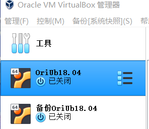


### 2. 配置OriUb18.04 NAT+host-only双网卡，获取host-only的ip地址

#### 	进入netplan文件，手动键入enp0s8的设置

` sudo vi /etc/netplan/01-netcfg.yaml `

键入`i`启用编辑界面

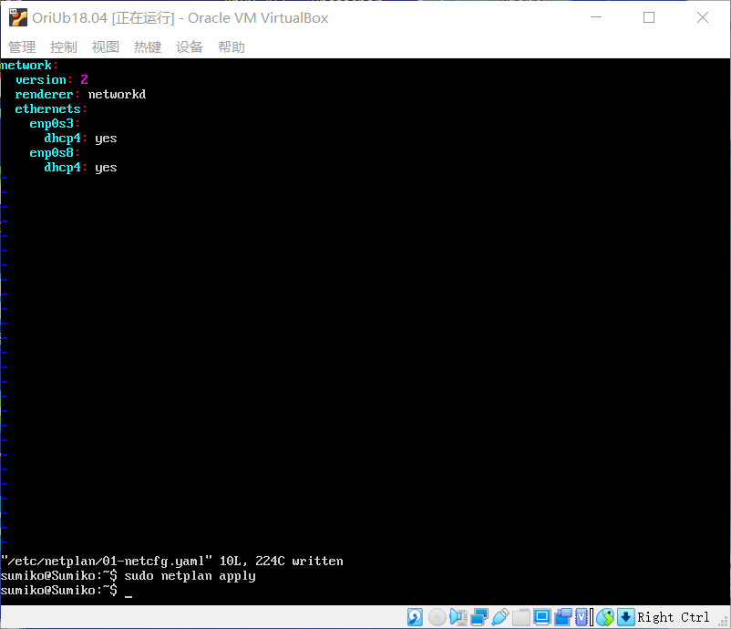

 退出vim编辑：`Esc +:x`

 应用编辑：`sudo netplan apply`

 参考：[怎么退出vim](https://www.cnblogs.com/cheneyboon/p/11454547.html) (新手真的查了才知道...)

#### 利用 `ifconfig`命令，查看当前网卡配置信息，并获得ip

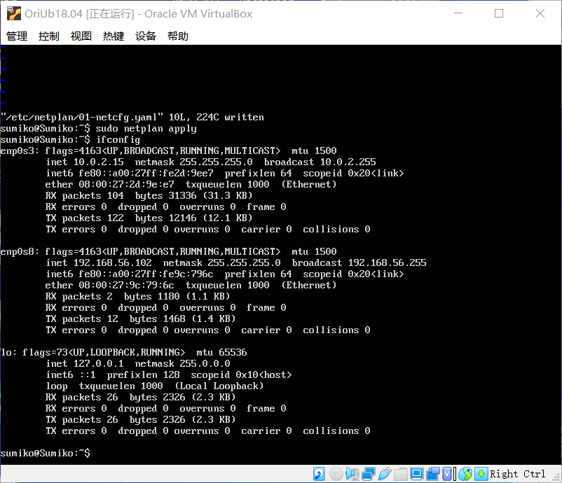


### 3. 启动putty，连接当前虚拟机

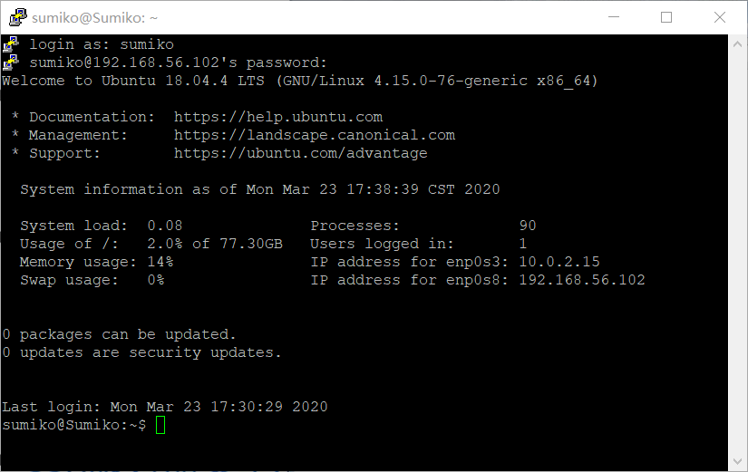

#### 打开psftp.exe，将镜像文件ubuntu-18.04.4-server-amd64.iso从本地上传到虚拟机

`cd`切换远程端目录，`lcd`切换本地目录

`put (iso文件)`

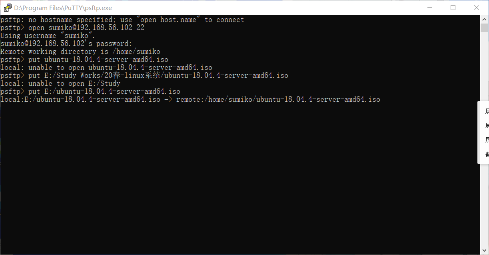

### 4. 在虚拟机中挂载iso镜像、修改txt.cfg

```
# 在当前用户目录下创建一个用于挂载iso镜像文件的目录
mkdir loopdir

# 挂载iso镜像文件到该目录
sudo mount -o loop ubuntu-18.04.4-server-amd64.iso loopdir

# 创建一个工作目录用于克隆光盘内容
mkdir tem
 
# 同步光盘内容到目标工作目录
rsync -av loopdir/ tem
```
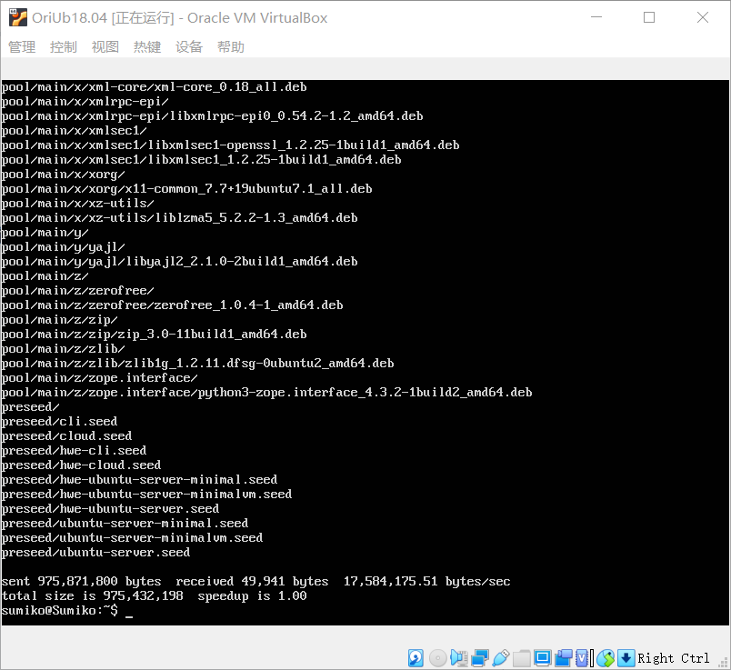

```
# 卸载iso镜像
umount loopdir

# 进入目标工作目录
cd tem/

# 编辑Ubuntu安装引导界面增加一个新菜单项入口
vim isolinux/txt.cfg

# 在txt.cfg文件顶部添加以下内容
label autoinstall
  menu label ^Auto Install Ubuntu Server
  kernel /install/vmlinuz
  append  file=/cdrom/preseed/ubuntu-server-autoinstall.seed debian-installer/locale=en_US console-setup/layoutcode=us keyboard-configuration/layoutcode=us console-setup/ask_detect=false localechooser/translation/warn-light=true localechooser/translation/warn-severe=true initrd=/install/initrd.gz root=/dev/ram rw quiet
```

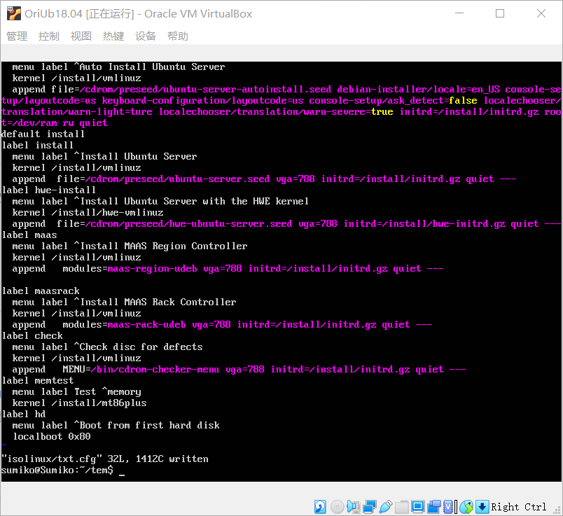

使用`Esc+:wq!`强制保存退出

### 5. 利用psftp将修改好的preseed文件上传至虚拟机，并保存到~/tem/preseed/目录

这里我直接用的老师提供的文件

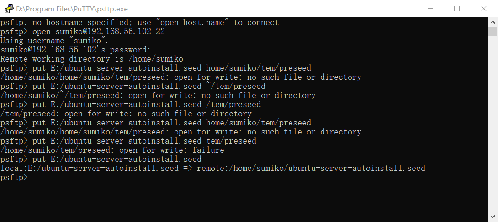

***

##### 问题1：直接把seed文件传到指定目录时，出现open for write: failure

解决：先将文件传到当前虚拟机端目录，再在虚拟机内通过mv命令移动到指定目录

mv命令需要sudo权限，否则会出现premission denied

`sudo mv ubuntu-server-autoinstall.seed teem/preseed/`

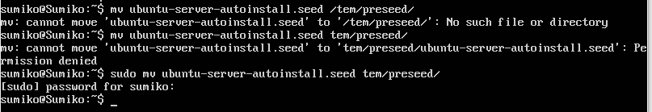

参考：[cp、mc、rm命令的使用_CSDN博客](https://blog.csdn.net/kzadmxz/article/details/74923559?depth_1-utm_source=distribute.wap_relevant.none-task&utm_source=distribute.wap_relevant.none-task)

***

#### 确认seed文件已放好

在preseed目录下利用模糊匹配，`find -name '*seed*'`

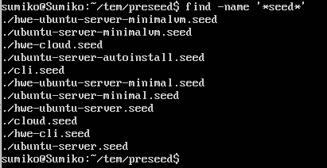


### 6. 重新生成md5sum.txt，封装改动后的目录

#### 重新生成md5sum.txt

`cd ~/tem && find . -type f -print0 | xargs -0 md5sum > md5sum.txt`

***

##### 问题2.1：第一次操作我漏掉了 `> md5sum.txt`，执行后输出了一堆代码....情急之下我按了两个q让输出停了下来(虽然感觉没什么用)，然后胆战心惊地重启了虚拟机...不知道会不会对文件有损害

##### 问题2.2：重启后我重新输入完整命令，结果出现了permission denied

解决：利用`chmod 777 md5sum.txt`命令给予md5sum.txt开放的权限

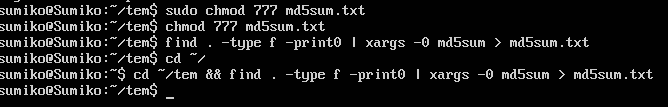

##### 问题2.3 执行后没有任何返回我又慌了..

解决：经查询才明白，输出重定向操作是不会有返回值的

***

#### 封闭改动后的目录到.iso

```
# 封闭改动后的目录到.iso
IMAGE=custom.iso
BUILD=~/cd/

mkisofs -r -V "Custom Ubuntu Install CD" \
            -cache-inodes \
            -J -l -b isolinux/isolinux.bin \
            -c isolinux/boot.cat -no-emul-boot \
            -boot-load-size 4 -boot-info-table \
            -o $IMAGE $BUILD
```

***

##### 问题3.1 无mkisofs，需安装genisoimage包

解决：`sudo apt install genisoimage`

##### 问题3.2 执行后报错：Unable to locate package

解决：`sudo apt-get update`

参考：[来源CSDN](https://blog.csdn.net/ljf_study/article/details/81591059)

##### 问题3.3 执行后又出错了..：Could not get lock /var/lib/apt/lists/lock

解决：大概是我先开了apt操作，进程冲突了，查了查说是互斥锁出问题。。？

```
sudo rm /var/lib/apt/lists/lock
sudo rm /var/lib/dpkg/lock
# 再执行sudo apt-get update
# 再下载genisoimage包
```

参考：[来源CSDN](https://blog.csdn.net/wanzew/article/details/81568393)

##### 问题3.4 执行后又又出错了= =||：apt-get: Package has no installation candidate

解决：趁网好再全部更新一遍。。。！

```
sudo apt-get update
sudo apt-get upgrade
sudo apt install genisoimage
```

参考：[来源网络论坛](https://www.bbsmax.com/A/obzbGvWMJE/)

终于成功了......

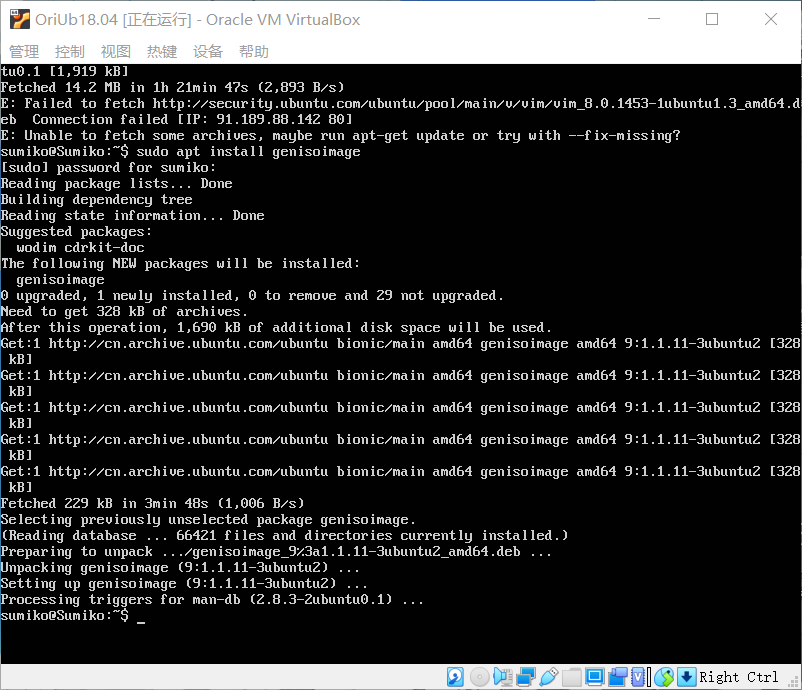

***

#### 执行mkisofs命令

直接在tem目录下用时会出现permission denied，需要在前面加上`sudo`

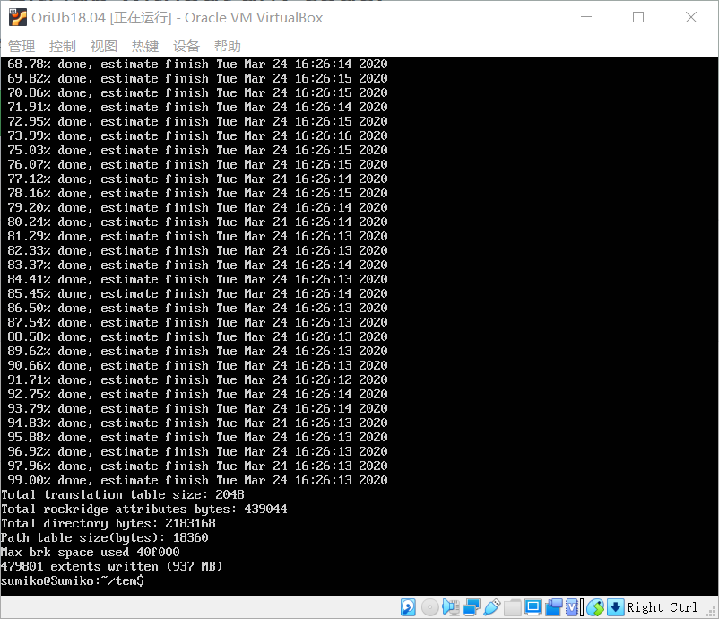


### 7. 利用psftp将custom.iso文件下载到本地

```
cd tem
get custom.iso
```

 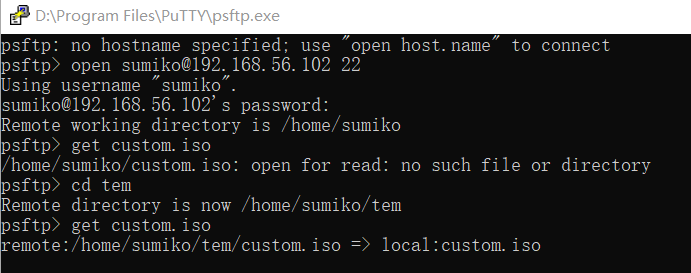

### 8. 新建虚拟机，添加custom.iso盘片，开始无人值守之旅吧！！


## 问题思考

### 1. 如何使用sftp在虚拟机和宿主机之间传输文件？

```
# 基本操作
# 切换远程目录
cd

# 切换本地目录
lcd

# 从虚拟机下载文件到宿主机
get 文件名

# 从宿主机传文件到虚拟机
put 文件名
```

**参考链接：[sftp常用命令_CSDN博客](https://blog.csdn.net/axing2015/article/details/89313460?depth_1-utm_source=distribute.pc_relevant.none-task&utm_source=distribute.pc_relevant.none-task)**

***

### 2. 老师修改的preseed文件和官方有何不同？

这个问题我参考了一位同学的，参考之后感觉对比网站太好用了，一目了然啊

自我理解总结：

- 老师提前设置了系统的用户名和域名
- 进入系统后自动选择在txt.cfg添加的置顶label项，而不是原项
- 选项的选择速度加快

包括老师提供的这一步

>  修改isolinux/isolinux.cfg，增加内容`timeout 10`（可选，否则需要手动按下ENTER启动安装界面）

我没有用，实践后知道这里的作用应该是把选语言的倒计时从30s改成10s

**参考链接：[linux-2020-Beautifullyl](https://github.com/CUCCS/linux-2020-Beautifullyl/pull/1/commits/e3f97571ab87d35c06b82aa41b3c744402484638?short_path=34bc1a3#diff-34bc1a3b7fb26e8363372ad6d4392b27)**

***

