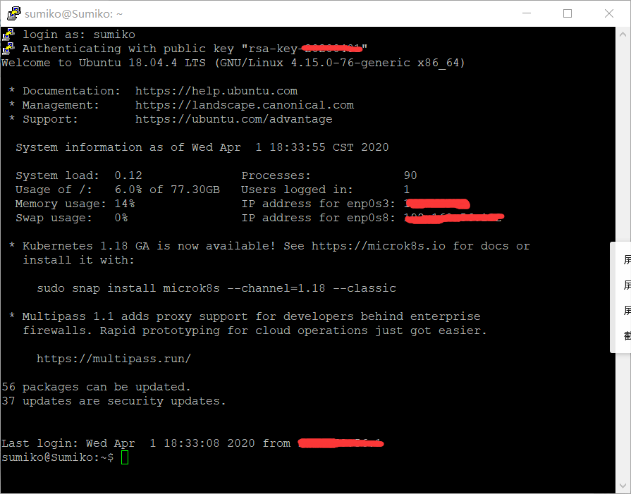

# 实验报告二

##### 实验内容：亲自操作vimtutor，并利用asciinema录像

##### 实验结果：[asciinema录像](https://asciinema.org/a/x4Y54VX2AR5XFTl3KWKt1g27B)


## 实验感想&收获

### 1. 补充完成了实验一的设置ssh免密登录

因为直接在虚拟机上确实太难操作了，诸如复制粘贴的操作不易于实施，于是在第二章视频的启发下，我完成了通过putty免密登录linux的设置。

具体操作我基本参考了[这篇CSDN博客](https://blog.csdn.net/zhaoxixc/article/details/82314957)，省去了修改文件权限的步骤。

成功截图：



### 2. 关于本次实验的反思

- 一开始我不知道怎么启动vimtutor，尝试输入`vim tutor`和`vim vimtutor`都失败了。后来我才了解到vimtutor不是一个文件也不是某种模式，而是一个shell下的可执行程序。

  【正确进入方法】直接输入`vimtutor`

- 这个向导建议用时30分钟，我做的明显太慢了。因为我中途一行行认真看了太久，还记了些笔记；后来看到向导里的提醒才意识到嗯。。要通过实践去记。。而不是硬记哇


## VIMTUTOR自查清单

#### 你了解vim有哪几种工作模式？

—— Normal、Visual、Insert、Replace四种

#### Normal模式下，从当前行开始，一次向下移动光标10行的操作方法？如何快速移动到文件开始行和结束行？如何快速跳转到文件中的第N行？

```json
#移动10行
10j
#开始行
gg
#结束行
G
#跳转第N行
NG
```

#### Normal模式下，如何删除单个字符、单个单词、从当前光标位置一直删除到行尾、单行、当前行开始向下数N行？

```json
#单个字符
x
#单个单词
dw
#光标一直到行尾
d$
#单行
dd
#当前行开始N行
Ndd
```

#### 如何在vim中快速插入N个空行？如何在vim中快速输入80个-？

—— `（数字N）o`

#### 如何撤销最近一次编辑操作？如何重做最近一次被撤销的操作？

—— NORMAL模式下`u`。按`CTRL-R`撤销。

#### vim中如何实现剪切粘贴单个字符？单个单词？单行？如何实现相似的复制粘贴操作呢？

—— 单个字符/单词/单行：光标移至所需字符/单词/行，`x`/`dw`/`dd`剪切，再移至粘贴位置，`p`粘贴

复制粘贴：`v`进入Visual模式，方向键选中复制内容，`y`进行复制，`p`粘贴

#### 为了编辑一段文本你能想到哪几种操作方式（按键序列）？

—— `i`/`A`/`a`（进入insert模式）

`r`/`R`（替换字符/单词）

#### 查看当前正在编辑的文件名的方法？查看当前光标所在行的行号的方法？

—— `CTRL-G`

#### 在文件中进行关键词搜索你会哪些方法？如何设置忽略大小写的情况下进行匹配搜索？如何将匹配的搜索结果进行高亮显示？如何对匹配到的关键词进行批量替换？

```json
#搜索
/keyword<ENTER>
?keyword<ENTER>
:s/keyword<ENTER>
#忽略大小写（完成搜索命令后）
:set ic
#高亮显示
:set hls is
#关闭高亮
:nohlsearch
#批量替换
:%s/old/new/g
```

#### 在文件中最近编辑过的位置来回快速跳转的方法？

—— `CTRL-I`和`CTRL-O`

#### 如何把光标定位到各种括号的匹配项？例如：找到(, [, or {对应匹配的),], or }

—— 将光标移到需匹配的括号上，按下`%`

#### 在不退出vim的情况下执行一个外部程序的方法？

—— NORMAL模式下，键入`:!(程序名)`

如`:!ls`、`:!dir`，再按`ENTER`可以返回vim

#### 如何使用vim的内置帮助系统来查询一个内置默认快捷键的使用方法？如何在两个不同的分屏窗口中移动光标？

—— 按下`HELP`or`F1`键，或者直接输入`help<ENTER>`。按`CTRL-W`进行切换窗口。