# 实验报告四

##### 实验内容：shell编程基础

##### 实验结果：[travis集成](https://travis-ci.com/github/Comi-fen/linux-2020-Comi-fen/builds/174598638)

​					[任务二数据](统计结果/worldcup.txt) [任务三数据](统计数据/weblog.txt)


## 实验环境

- Virtualbox

- Ubuntu 18.04.4 Server 64bit

- Windows 10


## 实验内容

- 任务一：用bash编写一个图片批处理脚本，实现以下功能：
  -  支持命令行参数方式使用不同功能 √
  -  支持对指定目录下所有支持格式的图片文件进行批处理 √
  -  支持以下常见图片批处理功能的单独使用或组合使用
    -  支持对jpeg格式图片进行图片质量压缩 √
    -  支持对jpeg/png/svg格式图片在保持原始宽高比的前提下压缩分辨率 √
    -  支持对图片批量添加自定义文本水印 √
    -  支持批量重命名（统一添加文件名前缀或后缀，不影响原始文件扩展名）√
    -  支持将png/svg图片统一转换为jpg格式图片√
-  任务二：用bash编写一个文本批处理脚本，对以下附件分别进行批量处理完成相应的数据统计任务：
  - 2014世界杯运动员数据
    -  统计不同年龄区间范围（20岁以下、[20-30]、30岁以上）的球员**数量**、**百分比** √
    -  统计不同场上位置的球员**数量**、**百分比** √
    -  名字最长的球员是谁？名字最短的球员是谁？√
    -  年龄最大的球员是谁？年龄最小的球员是谁？√
-  任务三：用bash编写一个文本批处理脚本，对以下附件分别进行批量处理完成相应的数据统计任务：
  - Web服务器访问日志
    -  统计访问来源主机TOP 100和分别对应出现的总次数 √
    -  统计访问来源主机TOP 100 IP和分别对应出现的总次数 √
    -  统计最频繁被访问的URL TOP 100 √
    -  统计不同响应状态码的出现次数和对应百分比 √
    -  分别统计不同4XX状态码对应的TOP 10 URL和对应出现的总次数 √
    -  给定URL输出TOP 100访问来源主机 √


## 实验结果

#### **任务一**

- [picedit.sh](shFile/picedit.sh)

  - 原图片见文件夹 **Before_pic**

    

  - 处理后图片见文件夹 **After_pic**

- 运行代码

  ```shell
  # 帮助文档
  bash picedit.sh -h
  ```
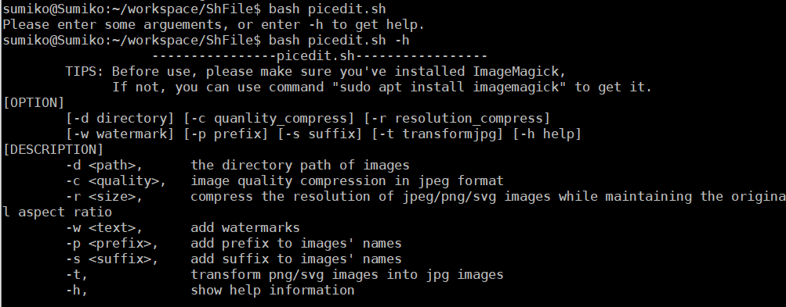
  

  ```shell
  # 对jpeg格式图片进行图片质量压缩
  bash picedit.sh -d ../pic/ -c 70%
  ```
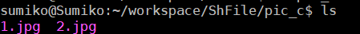

  ```shell
  # 对jpeg/png/svg格式图片在保持原始宽高比的前提下压缩分辨率
   bash picedit.sh -d ../pic/ -r 90
  ```
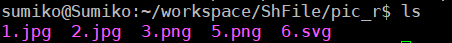

  ```shell
  # 对图片批量添加自定义文本水印
   bash picedit.sh -d ../pic/ -w "Comi"
  ```

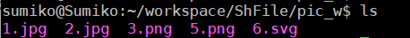  

  ```shell
  # 批量重命名（统一添加文件名前缀或后缀，不影响原始文件扩展名）
   bash picedit.sh -d ../pic/ -p "pre"
 bash picedit.sh -d ../pic/ -s "suf"
  ```
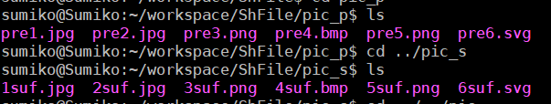


  ```sh
  # 将png/svg图片统一转换为jpg格式图片
   bash picedit.sh -d ../pic/ -t
  ```
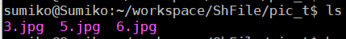

#### **任务二**

- [worldcup.sh](shFile/worldcup.sh)
- 运行代码

```shell
# 帮助
bash worldcup.sh -h
```

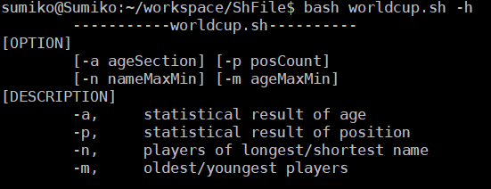

```shell
# 统计不同年龄区间范围（20岁以下、[20-30]、30岁以上）的球员数量、百分比
bash worldcup.sh -a
```

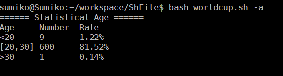

```shell
# 统计不同场上位置的球员数量、百分比
bash worldcup.sh -p
```

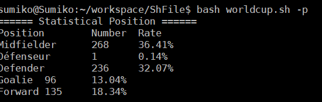

```shell
# 名字最长和最短的球员
bash worldcup.sh -n
```

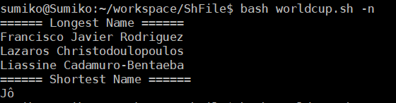

```shell
# 年龄最大和最小的球员
bash worldcup.sh -m
```

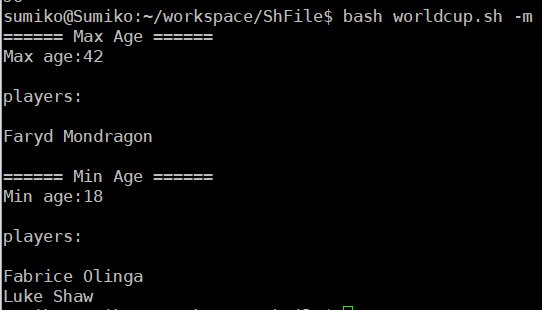

#### **任务三**

- [web_log.sh](shFile/web_log.sh)
- 运行代码

```shell
# 帮助
bash web_log.sh -h
```

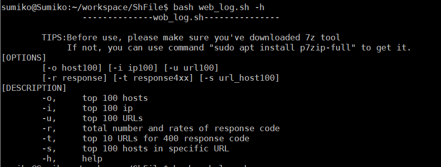

```shell
# 统计访问来源主机TOP 100和分别对应出现的总次数
bash web_log.sh -o
```

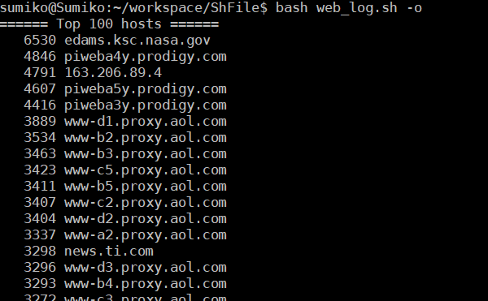

```shell
# 统计访问来源主机TOP 100 IP和分别对应出现的总次数
bash web_log.sh -i
```

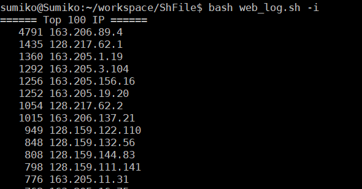

```shell
# 统计最频繁被访问的URL TOP 100
bash web_log.sh -u
```

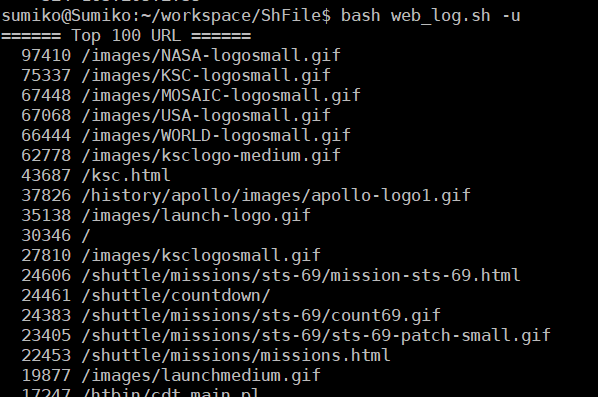

```sh
# 统计不同响应状态码的出现次数和对应百分比
bash web_log.sh -r
```

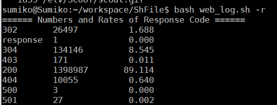

```sh
# 分别统计不同4XX状态码对应的TOP 10 URL和对应出现的总次数
bash web_log.sh -t
```

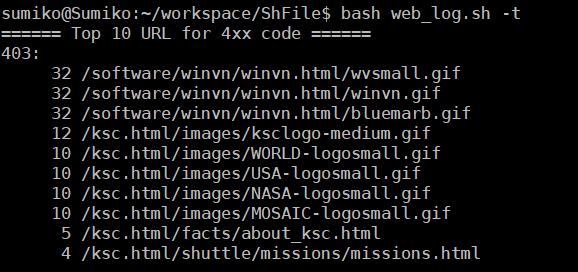

```sh
# 给定URL输出TOP 100访问来源主机
bash web_log.sh -s "/images/NASA-logosmall.gif"
```

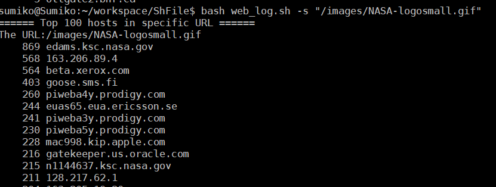

## 实验问题

**1. 从wiki下载weblog.7z过于缓慢，且gitee里的文件失效了**

   解决：将老师的仓库复制到个人gitee仓库中，再下载

## 参考资料

[ImageMagick 入门：使用命令行来编辑图片](https://www.linuxidc.com/Linux/2017-09/146845.htm)

[ImageMagick命令行使用方法](https://www.zouyesheng.com/imagemagick.html)

[linux-2019-Cassie8888](https://github.com/CUCCS/linux-2019-Cassie8888)

[linux-2019-Orange33](https://github.com/CUCCS/linux-2019-Orange33)

[linux shell 指令 诸如-d, -f, -e之类的判断表达](https://blog.csdn.net/qq_34457768/article/details/79387779)

[SFTP 怎么往服务器上上传整个文件夹？](https://zhidao.baidu.com/question/2272528754772984068.html)

[Linux awk 命令](https://www.runoob.com/linux/linux-comm-awk.html)

[linux awk命令详解](https://www.cnblogs.com/ggjucheng/archive/2013/01/13/2858470.html)

[Shell中IFS用法](https://www.cnblogs.com/fjping0606/p/4573536.html)