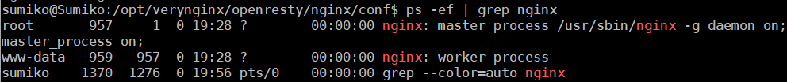
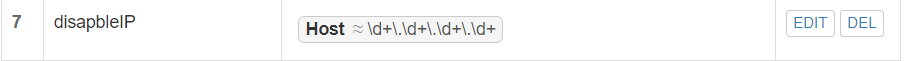
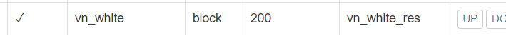
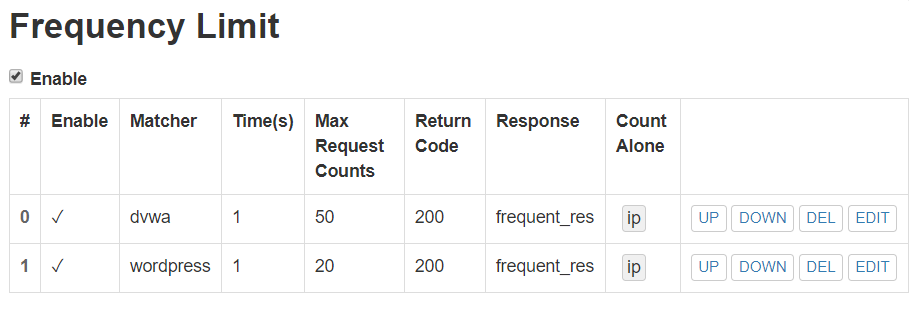
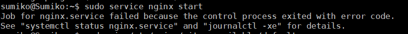

# 实验报告五

##### 实验内容：web服务器


## 实验环境

- Virtualbox
- Ubuntu 18.04.4 Server 64bit
- Windows 10
- Nginx (port:8080)
- VeryNginx (port:80)
- Wordpress (port:8080)
- Damn Vulnerable Web Application (DVWA) (port:8081)


## 实验内容

**1.在一台主机（虚拟机）上同时配置Nginx和VeryNginx**

- 安装Nginx

```json
# 安装Nginx
sudo apt install nginx
```

- 安装VeryNginx

```json
# 安装VeryNginx
git clone https://github.com/alexazhou/VeryNginx.git
sudo apt install libssl-dev libpcre3 libpcre3-dev build-essential
sudo apt install python
cd VeryNginx
sudo python install.py install
```

安装中报错，提示缺少zlib library:


```json
# 安装zlib依赖
sudo apt install zlib1g-dev
# 重新安装VeryNginx
sudo python install.py install
```


- 修改VeryNginx配置文件，默认在/opt/verynginx目录下

```json
cd /opt/verynginx/openresty/nginx/conf
sudo vim nginx.conf
```

`user`变量修改为`www-data`，server的监听端口修改为`192.168.56.102:80`


- 启动VeryNginx服务

```json
# 启动服务
sudo /opt/verynginx/openresty/nginx/sbin/nginx

# 和nginx同时占用80端口，启动失败，需关闭nginx
# 获取nginx进程号
ps -ef | grep nginx

# 结束该进程，再次启动verynginx
sudo kill -QUIT 957
sudo /opt/verynginx/openresty/nginx/sbin/nginx
```




- 修改Nginx配置， `sudo vim /etc/nginx/sites-available/default`，将端口改为8080


- 启动Nginx服务 `sudo service nginx start`

- 成功访问VeryNginx `192.168.56.102:80`,默认用户名密码都是verynginx


- 成功访问Nginx 


- PHP-FPM进程的反向代理配置在nginx服务器上

```json
# 安装mysql
sudo apt install mysql-server

# 安装php-fpm和php-mysql
sudo apt install php-fpm php-mysql

# 修改nginx文件
sudo vim /etc/nginx/sites-enabled/default
# 取消注释
location ~ \.php$ {
      include snippets/fastcgi-php.conf;
       fastcgi_pass unix:/var/run/php/php7.0-fpm.sock;
  }

# 重新启动nginx
sudo systemctl restart nginx
```

**2.使用Wordpress搭建的站点对外提供访问的地址为： http://wp.sec.cuc.edu.cn**

- 创建数据库wordpress，及对应用户wordpressuser

```json
# 切换到root用户
sudo su
# 登录mysql
mysql -u root -p

# 创建wordpress数据库
CREATE DATABASE wordpress DEFAULT CHARACTER SET utf8 COLLATE utf8_unicode_ci;

# 创建wordpressuser用户
GRANT ALL ON wordpress.* TO 'wordpressuser'@'localhost' IDENTIFIED BY 'password';

# 刷新权限
FLUSH PRIVILEGES;

# 退出mysql
exit;
```

- 安装php模块（已有7.2版本的php）

```json
# 安装php的其他扩展模块
sudo apt install php-curl php-gd php-intl php-mbstring php-soap php-xml php-xmlrpc php-zip

# 重启服务
sudo systemctl restart php7.2-fpm
```

- 安装WordPress4.7

```json
# 下载安装包
cd /tmp
sudo wget https://wordpress.org/wordpress-4.7.zip

# 解压文件
unzip wordpress-4.7.zip

# 将示例配置文件复制到WordPress实际读取的文件中
sudo cp /tmp/wordpress/wp-config-sample.php /tmp/wordpress/wp-config.php

# 复制到文档根目录中
sudo cp -a /tmp/wordpress/. /var/www/html/wordpress

# 赋予/var/www/html可执行权限
sudo chmod -R 777 /var/www/html/wordpress
```

- 配置WordPress

```json
# 从WordPress密钥生成器中获取安全值
curl -s https://api.wordpress.org/secret-key/1.1/salt/

# 复制到以下配置文件中
sudo vim /var/www/html/wordpress/wp-config.php
# 替换以下内容
. . .
define('AUTH_KEY',         'VALUES COPIED FROM THE COMMAND LINE');
define('SECURE_AUTH_KEY',  'VALUES COPIED FROM THE COMMAND LINE');
define('LOGGED_IN_KEY',    'VALUES COPIED FROM THE COMMAND LINE');
define('NONCE_KEY',        'VALUES COPIED FROM THE COMMAND LINE');
define('AUTH_SALT',        'VALUES COPIED FROM THE COMMAND LINE');
define('SECURE_AUTH_SALT', 'VALUES COPIED FROM THE COMMAND LINE');
define('LOGGED_IN_SALT',   'VALUES COPIED FROM THE COMMAND LINE');
define('NONCE_SALT',       'VALUES COPIED FROM THE COMMAND LINE');
. . .
# 修改用户名密码，与sql一致
define('DB_NAME', 'wordpress');
      
define('DB_USER', 'wordpressuser');
      
define('DB_PASSWORD', 'password');
```


- 修改nginx配置

```json
# 备份原始文件，再不备份自杀了
sudo cp /etc/nginx/sites-available/default /etc/nginx/sites-available/bf
# 修改配置
sudo vim /etc/nginx/sites-enabled/default

# 修改根访问目录
root /var/www/html/wordpress;
# 更改server_name
server_name wp.sec.cuc.edu.cn;
# 添加index.php
index index.php index.html index.htm index.nginx-debian.html;

# 重新加载nginx
sudo systemctl restart nginx
```

- 实现域名http://wp.sec.cuc.edu.cn访问

```json
# 在虚拟机的/etc/hosts和本机C:\Windows\System32\drivers\etc\hosts添加以下内容
192.168.56.102 wp.sec.cuc.edu.cn
```


**3.使用Damn Vulnerable Web Application (DVWA)搭建的站点对外提供访问的地址为： http://dvwa.sec.cuc.edu.cn**

- 安装DVWA

```json
sudo git clone https://github.com/ethicalhack3r/DVWA
sudo mv DVWA /var/www/html

# 将DVWA的配置文件重命名
sudo cp /var/www/html/DVWA/config/config.inc.php.dist /var/www/html/DVWA/config/config.inc.php
```

- 配置php文件

```json
sudo vim /etc/php/7.2/fpm/php.ini

# 修改对应内容
allow_url_include = On
display_errors = off

# 重启php-fpm
sudo systemctl restart php7.2-fpm
```

- 分配访问权限

```json
sudo chown -R root.root /var/www/html/DVWA
```

- 配置mysql

```json
sudo su
sudo mysql -u root -p

> CREATE DATABASE dvwa DEFAULT CHARACTER SET utf8 COLLATE > > utf8_unicode_ci;
> GRANT ALL ON dvwa.* TO 'dvwauser'@'localhost' IDENTIFIED BY 'p@ssw0rd';
> FLUSH PRIVILEGES;
> exit;

# 重启mysql
sudo systemctl restart mysql
```

- 编辑DVWA配置文件

```json
sudo vim /var/www/html/DVWA/config/config.inc.php

# 配置自动生效
$_DVWA[ 'db_server' ]   = '127.0.0.1';
$_DVWA[ 'db_database' ] = 'dvwa';
$_DVWA[ 'db_user' ]     = 'dvwauser';
$_DVWA[ 'db_password' ] = 'p@ssw0rd';
```

- 添加Nginx配置，开启8081监听端口

```json
sudo vim /etc/nginx/sites-available/default

# 在文件中添加以下内容
server {
     listen 8081;
     listen [::]:8081;

     server_name dvwa.sec.cuc.edu.cn;

     root /var/www/html/DVWA;
     index index.html setup.php index.htm index.php index.nginx-debian.html;
     location / {
             try_files $uri $uri/ =404;
       }
     # 配置php-fpm反向代理
     location ~ \.php$ {
             include snippets/fastcgi-php.conf;
             fastcgi_pass unix:/var/run/php/php7.2-fpm.sock;
     }
 }

# 重启nginx
 sudo systemctl restart nginx
```

- 访问DVWA成功


- 用域名访问

```
# 在虚拟机的/etc/hosts和本机C:\Windows\System32\drivers\etc\hosts添加以下内容
 192.168.56.102 dvwa.sec.cuc.edu.cn
```

	登录默认用户名admin密码password

## 实验检查点

**1.VeryNginx作为本次实验的Web App的反向代理服务器和WAF**

- 在verynginx中配置matcher/upstream/proxy pass


**安全加固要求**

- 使用IP地址方式均无法访问上述任意站点，并向访客展示自定义的友好错误提示信息页面-1

  - 添加matcher

  

  - 添加response

  

  - 添加filter

  

- DVWA只允许白名单上的访客来源IP，其他来源的IP访问均向访客展示自定义的友好错误提示信息页面-2

  

  

  

- 在不升级Wordpress版本的情况下，通过定制VeryNginx的访问控制策略规则，热修复WordPress < 4.7.1 - Username Enumeration


- 通过配置VeryNginx的Filter规则实现对Damn Vulnerable Web Application (DVWA)的SQL注入实验在低安全等级条件下进行防护

  

  

  

**VeryNginx配置要求**

- VeryNginx的Web管理页面仅允许白名单上的访客来源IP，其他来源的IP访问均向访客展示自定义的友好错误提示信息页面-3

  - 添加matcher

  

  - 添加response

  

  - 添加filter

  

- 通过定制[VeryNginx](https://github.com/alexazhou/VeryNginx)的访问控制策略规则实现：

  - 限制DVWA站点的单IP访问速率为每秒请求数 < 50
  - 限制Wordpress站点的单IP访问速率为每秒请求数 < 20

  

  - 超过访问频率限制的请求直接返回自定义**错误提示信息页面-4**

  

  - 禁止curl访问
    - 添加matcher

    

    - 添加response

    

    - 添加filter

    

## 实验问题

- 因为网络问题无法通过两个链接直接下载wordpress4.7

  - 解决方法：在有VPN的设备里下好压缩包发送至电脑，再通过psftp上传到虚拟机/tmp文件夹里。。。曲线救国
  
- 做DVWA任务添加Nginx的配置时，不小心把默认配置直接改了。。。而不是在文件末尾添加配置。。导致Nginx配置出现问题无法启动，而且我并没有备份原配置文件。。。

  

  - 通过`journalctl -xe`查看运行日志发现错误：缺少“ }”符号

  

  - 仔细检查文本发现是在取消注释的时候没有把}的注释也取消，导致出错

  

  - 反省：下次直接修改文件的时候一定一定一定要进行备份

- 域名或ip访问wordpress时显示403forbidden


​		解决方法：根据参考资料4，发现是因为需要php服务，但nginx配置中没有加入index.php，且我安装的php为7.2版本，注释里是7.0。修正后成功访问

## 参考资料

[linux-2019-Cassie8888](https://github.com/CUCCS/linux-2019-Cassie8888)

[linux-2019-jackcily](https://github.com/CUCCS/linux-2019-jackcily)

[alexazhou/VeryNginx](https://github.com/alexazhou/VeryNginx/blob/master/readme_zh.md)

[解决Nginx出现403 forbidden (13: Permission denied)报错的四种方法](https://blog.csdn.net/onlysunnyboy/article/details/75270533)